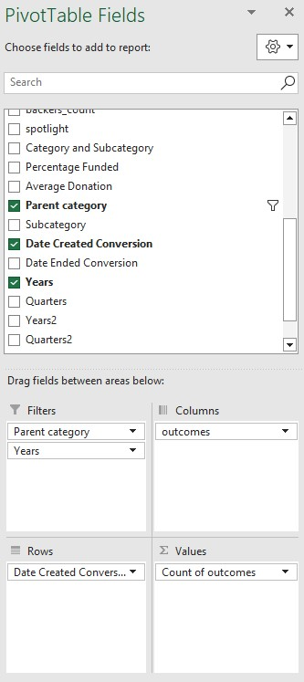
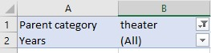
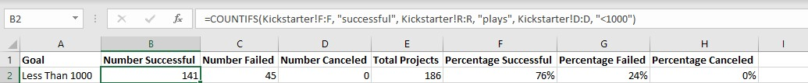
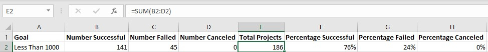
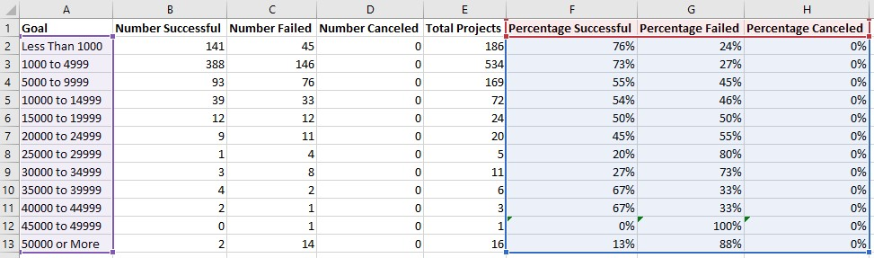

# kickstarter-analysis
# Kickstarting with Excel

## Overview of Project

### Purpose

Louise gave us the task to go through the information she gave us to find how the 
outcomes of different campaigns and their launch goals by creating new sheets, inputting different formulas, creating a pivot chart and inputting the information into the correct areas and creating visualizations through graphs.

## Analysis and Challenges

### Analysis of Outcomes Based on Launch Date

For the first part of the project, Louise wanted us to find the theater outcomes based 
by the launch date. 

The first step I took was adding a column labeled as "Years" and using the Year() function to extract the data from the "Date Created Conversion" to find the year. After doing so, I took the information from the 'Kickstarter' worksheet and created a pivot table. To set up the pivot chart, I placed the fields 'parent category' and 'years' into the filter area, 'outcomes' in both columns and values, and the 'date created conversion' in the rows area.

Once I placed the fields in their appropriate areas, I filtered the parent category to only show the outcomes from the theater section. 

By doing this, we can now see monthly how many campaigns in the theater campaigns were successful, how many failed and how many ended up canceling. 

To create a visual for this project we were instructed to use a line chart with markers. To do this, I went to the insert tab and had a choice of the type of line chart and selected the one with markers to be able to have the visual.

### Analysis of Outcomes Based on Goals

The second part of our project required us to create a visualization for the percentage of successful, failed and canceled plays. 

From the Kickstarter sheet I created a new sheet and labeled it Outcomes Based on Goals. In the new sheet we created eight new columns starting with Goal and set dollar amount ranges so the projects would be grouped based on the goal amount.The next three columns consisted of Number Successful, Number Failed, and Number Canceled.

I used the COUNTIFS() function to populate the columns. From the Kickstarter sheet, I labeled my first criteria which was the Outcomes column. From there I chose between successful, failed, and canceled. My second criteria was under my subcategories column. To filter the column for it to only show plays, I labeled the column and in quotations typed in plays. For the final part, I had to filter them by the goal amount using the sign > and <.

After calculating each column in the Outcomes Based on Goals sheet, I found the total amount of projects by using the Sum() function. To do this I went from rows B to D and added each row together.

After finding the sum of the numbers successful, failed and canceled, I divided columns B, C and D by E to find the percentages!

The next step to take was creating a line chart for visualization. This portion did not require using all of the information on the sheet so I highlighted the goal column and the percentage columns and inserted our line chart. 

### Challenges and Difficulties Encountered

Overall I could say that this analysis was something I had to try twice, once to get familiar with the content and a second time to fully immerse and learn. The most challenging part for me was using the COUNTIFS() function and making sure that all of the criteria was labeled. The first time attempting it I was missing one criteria which was throwing my information off completely and had had my line chart far from what the end result was suppose to look like. I asked a fellow classmate of mine to compare data and that really helped me detect what was wrong in my code and what I saw was wrong was my criteria was set for a different column than the previous!

## Results

- What are two conclusions you can draw about the Outcomes based on Launch Date?

In the Theater Outcomes by Launch Date I can conclude that May to June were on the higher end of being successful and failing. I can also conclude that December fell on the lower end!

- What can you conclude about the Outcomes based on Goals?

I can conclude on the outcomes based on goals that the campaigns we successful at first but as the goal kept increasing, then the more it would decrease while the failures would continue to increase with no canceled campaigns.

- What are some limitations of this dataset?

The limitations to this dataset is that there were too many participants and that made the range of the data large.

- What are some other possible tables and/or graphs that we could create?

There are other possibilities that are made available to make. For example, we can make our line charts into clustered columns to have a side by side comparison which personally I love for the visual aspect.
